# Parker

#### A parking automizing system, where all that user need to do is scan QR code on entering, and exit without doing anything    

## How it works
- **Setup:**  
**1.** C++ compiled command-line program.  
**2.** Firebase database.  
**3.** Camera at entry and exit barricades.  
**4.** Android app for user interaction.   

- **Parking Entry:**  
When driver enters parking area, the car will stop at entry barricade.  
The camera on barricade will scan and detect the number plate and generate QR code containing the detected car number and session ID. The QR code will be shown on the panel attached to the side of barricade something like this: (only QR code)  
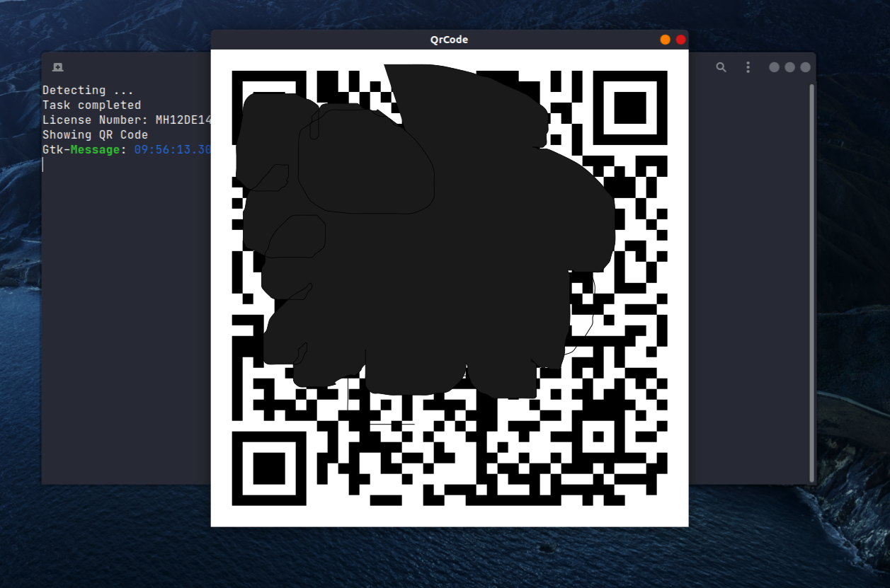  
Once driver scans this QR code from app, the session will start and barricade will open. Driver can now park the car.    

- **Parking Exit:**  
The car will again stop at exit barricade and the camera on it will scan and detect the number plate. If the number plate is the same that entered previously, then terminate the session, notify driver with the calculated amount and barricade will open for car to exit.   

## Screenshots of App

Click to expand

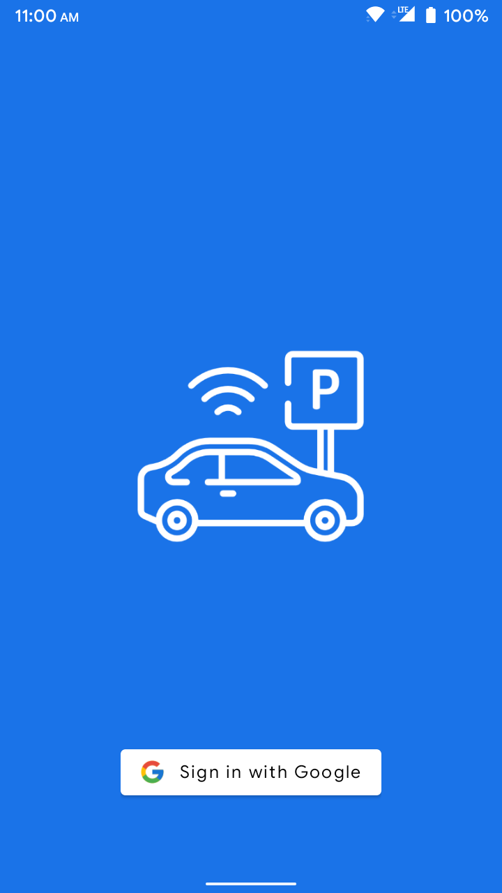 &nbsp;
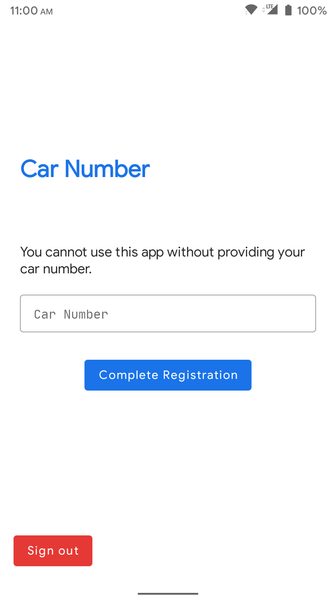 &nbsp;
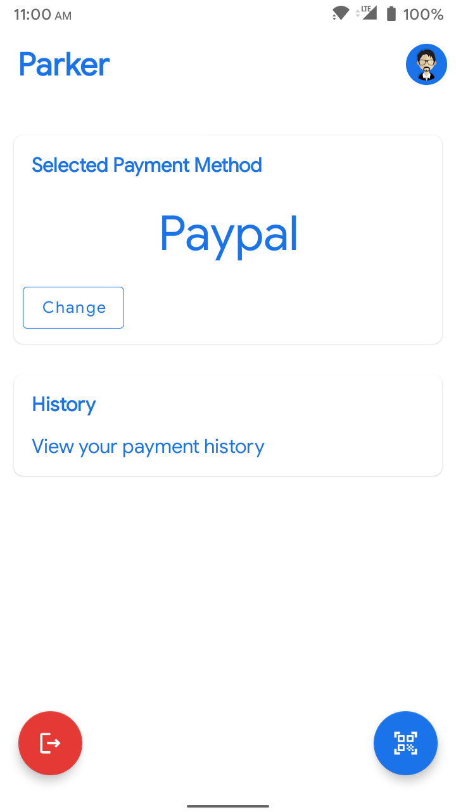 &nbsp;  

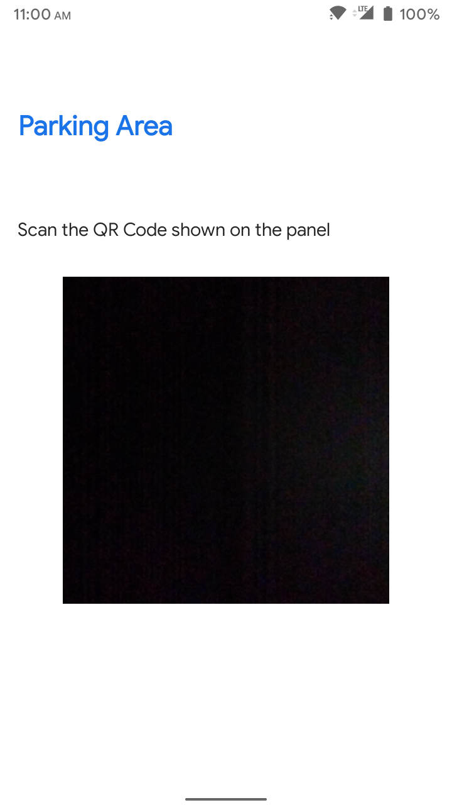 &nbsp;
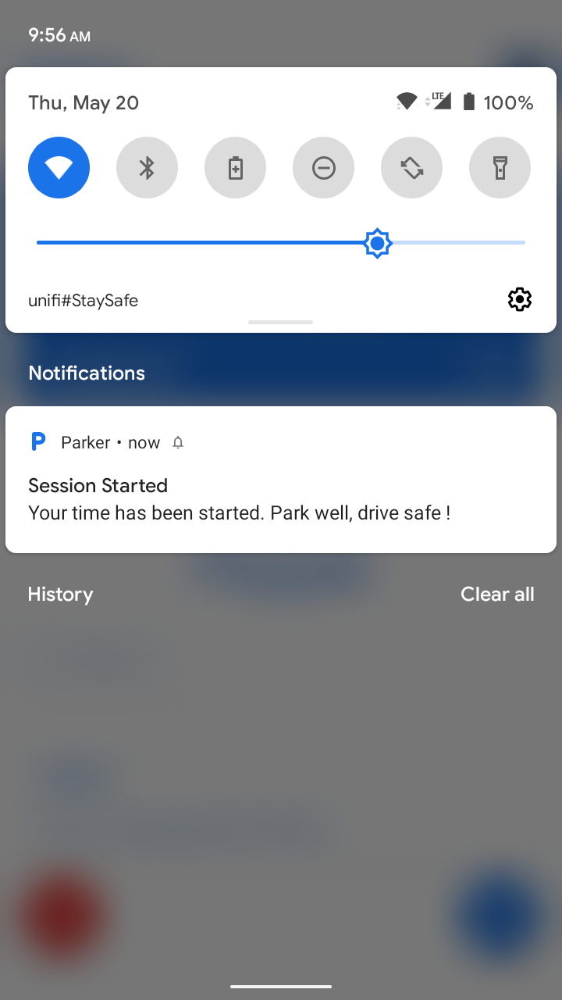 &nbsp;
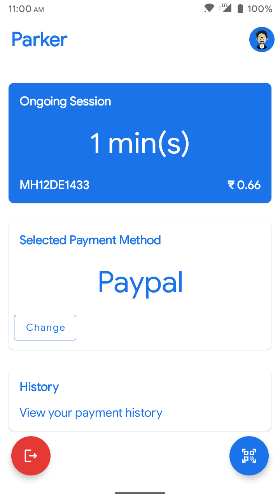 &nbsp;  

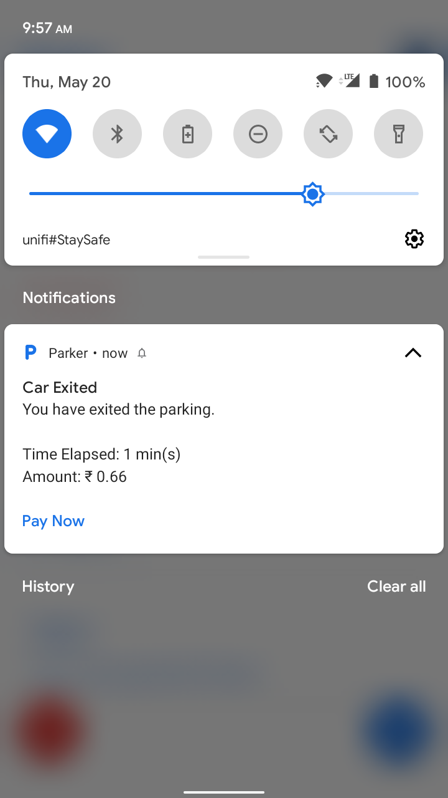 &nbsp;
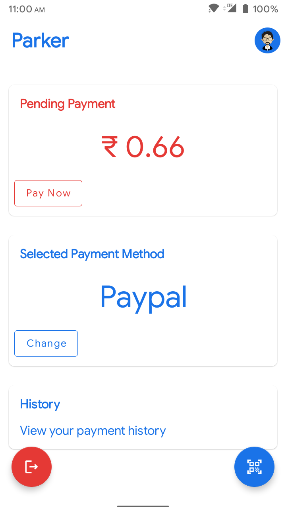 &nbsp;
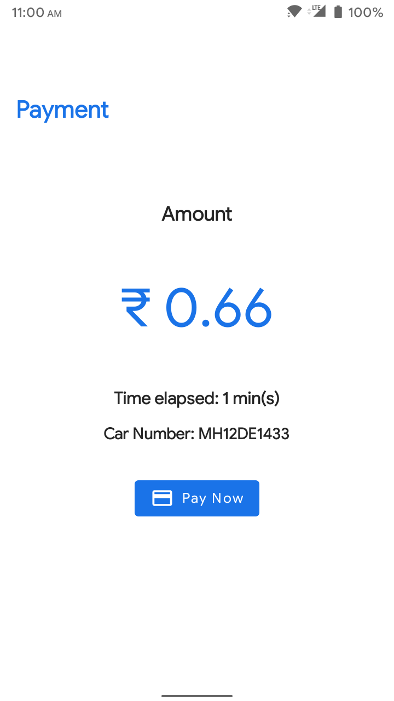 &nbsp;  

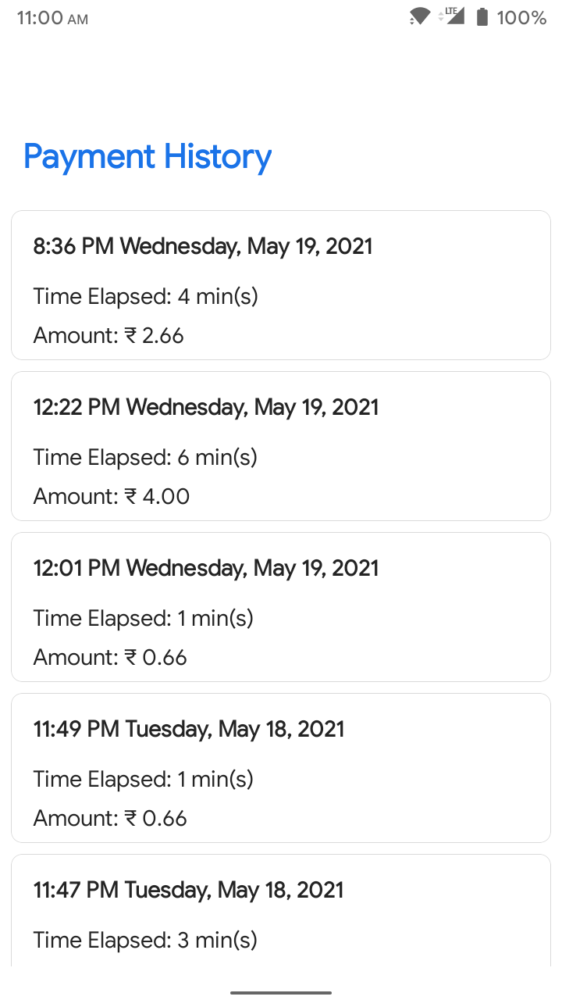 &nbsp;

   

## Tool, Frameworks and Languages used
| Product | Tool | Frameworks | Languages |
|:-------:|:-----:|:----------:|:---------:|
| App     | Android Studio | AndroidX Firebase Material UI CameraX | Kotlin  Java  XML |
| Command Line Backend | CLion | Firebase Node js OpenCV Tesseract-OCR | C++ Python Javascript |
  

## Developers
- Shashank Verma
- Naman Agrawal
- Shashank Saxena
- Jay Aggarwal
